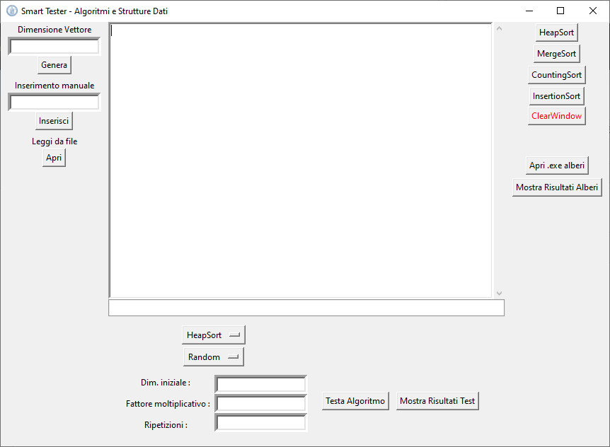
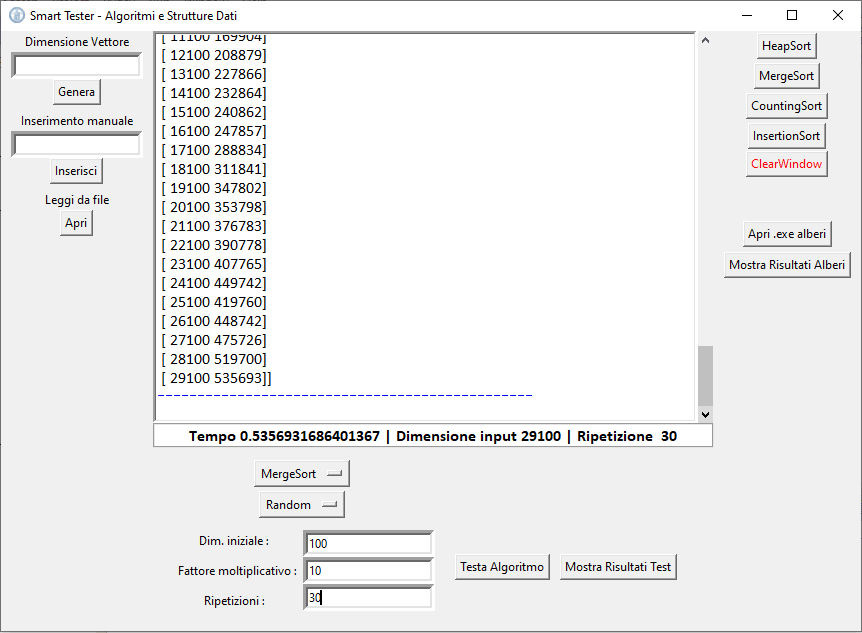
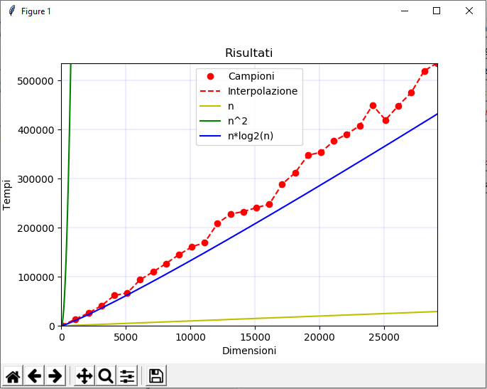
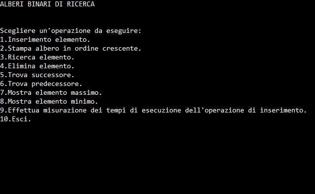

# Algoritmi-e-Strutture-Dati

[README inglese](README.md)

Questo semplice codice è stato scritto in pochi giorni insieme ad un collega d'università ed include:

- Implementazione Python 3 di alcuni algoritmi di ordinamento (con analisi computazionale)
- Implementazione C++ di alberi binari

---------------------------------------------------------------

## Codice Python

Il programma, chiamato "Smart Tester", possiede un'interfaccia grafica creata con Tkinter, una delle librerie più utilizzate per la creazione di GUI in Python. È possibile osservare tale interfaccia nell'immagine sottostante.

Sulla sinistra sono presenti alcune entry e pulsanti con cui si può generare un vettore di numeri interi random (dando la lunghezza in input), inserire un vettore manualmente o leggerlo da file txt. Oltre agli interi, si possono anche considerare caratteri o strighe. Successivamente si può effettuare l'ordinamento con l'algoritmo che si preferisce (Heap Sort, Merge Sort, Counting Sort, Insertion Sort), utilizzando i bottoni sulla destra.
In basso, è possibile testare uno degli algoritmi dando in input un vettore con valori randomici, crescenti o decrescenti per N volte. Il test prevede che la dimensione iniziale sia moltiplicata per il fattore moltiplicativo per ogni ripetizione, ottenendo un array sempre più grande. Su ogni array il programma calcola i tempi di esecuzione dell'algoritmo di ordinamento in microsecondi, ottenendo un campione, e alla fine si possono mostrare i risultati su un grafico e confrontare la funzione ricavata collegando i campioni con le funzioni n,n^2,n*log2(n). Un esempio è mostrato di seguito:

In questo modo è possibile stimare la complessità temporale dell'algoritmo.

---------------------------------------------------------------

## Codice C++

Il programma degli alberi binari è incluso nello "Smart Tester". Esso viene eseguito se si clicca sul pulsante "Apri .exe alberi". Ovviamente il file eseguibile "alberi" deve essere presente nella directory di progetto. Nel prompt aperto, si può digitare un numero per scegliere l'operazione da eseguire.

Per quanto riguarda il test, i risultati sono salvati su un file txt e possono essere letti e mostrati su un grafico, cliccando sul pulsante "Mostra Risultati Alberi" presente nell'interfaccia Tkinter.

