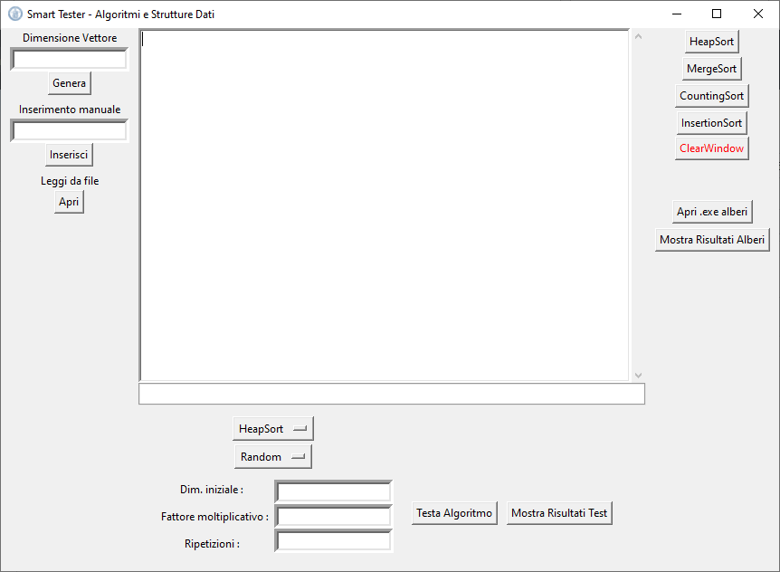
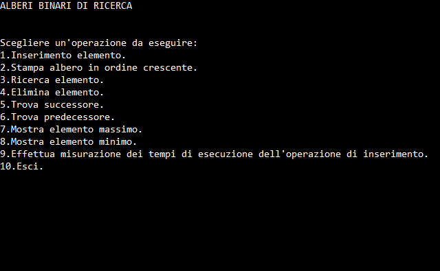

# Algorithms-and-Data-Structures

[Italian README](README-it.md)

This simple code was written in few days with a fellow student for a college exam and it includes:

- Python 3 implementation of some sorting algorithms (with computational analisys)
- C++ implementation of binary tree data structure

---------------------------------------------------------------

## Python code

The program, called "Smart Tester", has a graphical interface created with Tkinter, Python's de-facto standard GUI package. You can see it in the image below.

On the left you can generate an array of random integers giving the length as input, insert the array manually or read it from a txt file. In addition to integers, you can also consider characters or strings. Then you can sort the values with the algorithm you prefer (Heap Sort, Merge Sort, Counting Sort, Insertion Sort), using the buttons on the right.
On the bottom, you can test one of these algorithms by giving it an input array with random, ascendent or descendent values for N times. The test requires that the initial length is multiplied by the multiplication factor for each loop, obtaining an increasingly large array. On each array the program calculates the execution times of the algorithm in microseconds, getting a sample, and finally you can show the results on a graph and compare the function obtained by linking the samples with n,n^2,n*log2(n) functions. An example is shown below:

In this way you can estimate the time complexity of the chosen algorithm.

---------------------------------------------------------------

## C++ code

The binary tree program is included in "Smart Tester". It runs if you click on "Apri .exe alberi" button. Obviously the executable file "alberi" must be in the project directory. In the opened prompt, you can type a number to choose the operation.

So you can:
1. Insert a node in the tree
2. Print the nodes of the tree in ascending order
3. Search a node
4. Delete a node
5. Find the successor of a node
6. Find the predecessor of a node
7. Show maximum value
8. Show minimum value
9. Test the insert operation analyzing execution times
10. Exit

Regarding the test, the results are saved on a txt file and you can read it and show the graph by clicking on the button "Mostra Risultati Alberi" in the GUI.

